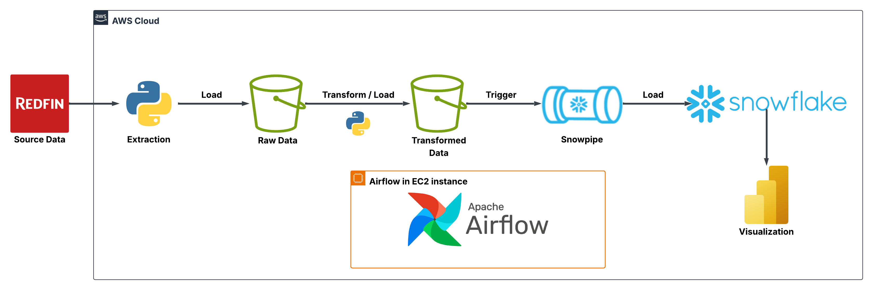
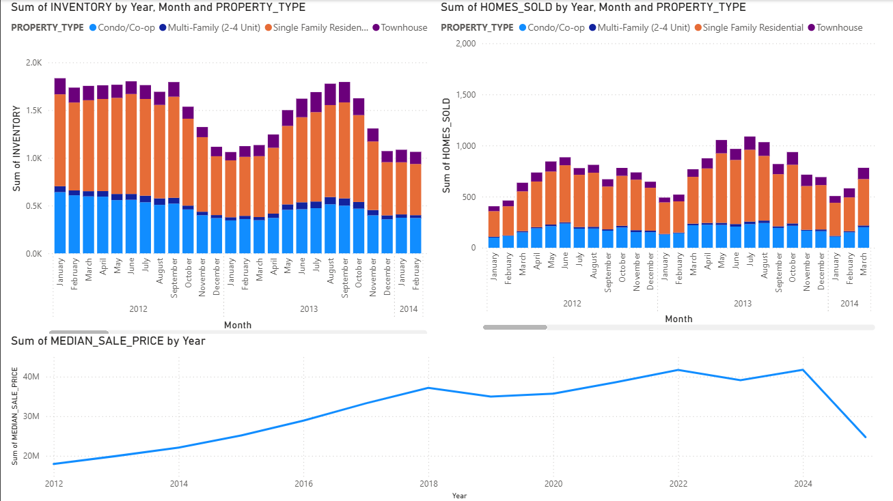

# 🏡 Redfin Data Pipeline on AWS with Airflow & Snowflake

This project demonstrates a complete **Data Engineering pipeline** that extracts, transforms, and loads real estate data from **Redfin** into **Snowflake**, orchestrated with **Apache Airflow** on **AWS EC2**, and visualized in **Power BI**.

---

## 🚀 Project Workflow

1️⃣ **Extract**  
- Pulled real estate housing data from **Redfin’s public dataset**.  

2️⃣ **Transform**  
- Removed null values  
- Cleaned strings in columns  
- Added new time-based columns (Year, Month)  
- Selected relevant features for analysis  
- Optimized schema for downstream analytics  

3️⃣ **Load**  
- Stored raw and transformed data into **separate AWS S3 buckets**  
- Configured **Snowpipe** to continuously load transformed data into **Snowflake**  

4️⃣ **Visualize**  
- Built dashboards in **Power BI** to explore housing trends  

---

## 🏗️ Architecture



---

## 📂 Repository Contents

- `dags/redfin_analytics.py` → Apache Airflow DAG for ETL pipeline  
- `snowflake/worksheet.sql` → Snowflake schema, stage, file format & Snowpipe setup  
- `architecture/architecture.png` → End-to-end architecture diagram
- `visualization/visualization.png` → Data Visualization
- `requirements.txt` → Project dependencies
- `commands.txt` → Shell script with all commands for AWS EC2 setup & Airflow run
---

## ⚡ Tech Stack

- **AWS (S3, EC2)**  
- **Apache Airflow** (Pipeline orchestration)  
- **Python (Pandas, Boto3)**  
- **Snowflake + Snowpipe** (Cloud Data Warehouse)  
- **Power BI** (Visualization)  

---

## 🛠️ Setup & Run

1. Clone this repository:  
   ```bash
   git clone https://github.com/mhamza-codes/aws-redfin-etl-pipeline.git
   cd aws-redfin-etl-pipeline
   ```

2. Install dependencies:  
   ```bash
   pip install -r requirements.txt
   ```

3. Configure AWS credentials (`aws configure`) and Snowflake connection.  

4. Deploy the DAG into your Airflow environment (`dags/` folder).  

5. Run the DAG and monitor execution in the Airflow UI.  

---

## 📊 Visualization

After data was loaded into Snowflake, I connected it to **Power BI** to create charts for analyzing housing market insights.  

  

---

## 🌟 Key Learnings

- Designing scalable ETL pipelines  
- Automating workflows with Airflow on AWS EC2  
- Handling large datasets with chunking in Pandas  
- Integrating AWS → Snowflake → Power BI seamlessly  

---

## 🤝 Connect

If you find this project useful, feel free to ⭐ the repo and connect with me on [LinkedIn](https://www.linkedin.com/in/-muhammad-hamza/).  

---
